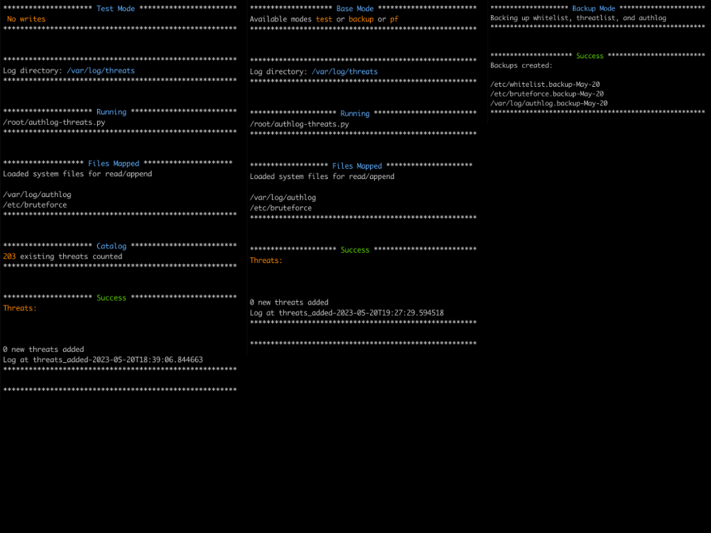
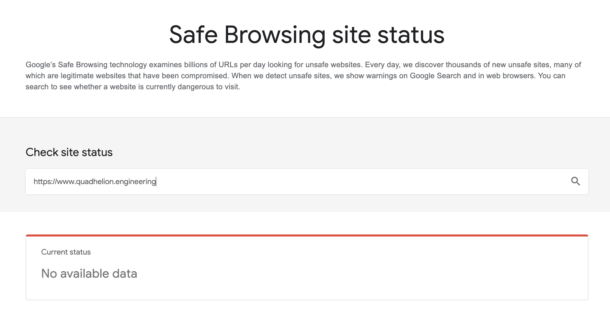

# Add new authlog threats to pf 


This functionless easy-to-read-is-security simple script with under a 100 lines of working code (minus comments and printing) is meant to provide the OpenBSD administrator with a tool to parse the authlog and insert threatening IP addresses into pf (packer filter) firewall to block those threats with logging and automatic pf table reload recognition to be used optionally in crontab.




## Features:
* Whitelist CIDR IP address notation support
* Fully vetted list of Vulnerability Scanners for blocking; LICENSE: (Amended) CC BY-NC-SA 4.0
* Selective pf table updates

## Scope:

* IPv4 addresses only
* Python 3.10 (OpenBSD default)
* ksh (OpenBSD default)
* OpenBSD 7.3 default targeted, throughly tested, production ready
  


## Requirements:

* An authlog that does not log IP addresses that cannot be either in the whitelist or the blacklist, XOR.
    * e.g. 127.0.0.1, IPv6 Multicast, etc.
    * 0.0.0.0 is specifically excluded from parsing in the script as this does rarely happen and would be disastrous to either whitelist or blacklist
	
* A whitelist that contains the IP Addresses that are allowed to authenticate

* A pf.conf with at least 2 tables, one a whitelist and one for "badhosts"/"blacklist"
    * **You must have a whitelist with all your own IP Addresses used to authenticate or you will block yourself from logging in**
    * The following is a common pf.conf pattern

```sh
## Whitelist
table <whitelist> persist file "/etc/whitelist"
pass in quick from <whitelist> 


## Badhosts
table <badhosts> persist file "/etc/badhosts"
block in quick from <badhosts>
```

See also [this example](https://github.com/sinner-/ansible-freebsdvps/blob/master/roles/pf/templates/pf.conf.j2) and [this example](https://blog.thechases.com/posts/bsd/aggressive-pf-config-for-ssh-protection/) and the repo example.

* A new directory made by the Licensee for the script to write the log of threats added by the script for the admin to easily track for inspection and auditing
    * Assumes directory `/var/log/threats/` 


## Script Modes/Arguments:

This script has 3 modes all singular, not combinable, and **should be run in this order**:

* backup `authlog-threats.py backup`

    1. Makes a `.backup` file of the authlog`/var/log/authlog.backup-Month-Day`, "badhosts" `/etc/badhosts.backup-Month-Day`, and whitelist `/etc/whitelist.backup-Month-Day` 
    2. Safely remove old backups with command `rm *.backup-*`
    3. I scripted this so you can also crontab the backup mode alternate to the additions schedule just in case

* test `authlog-threats.py test`

    1. **If you do not do this you can lock yourself out of your own system!**
    2. Reads out the count of IP addresses in the existing file
    3. Does not actually write to "badhosts" file but writes entires out to stdout
    4. Manually review this list to make sure no unwanted IP addresses are in there

* No arguments

    1. Will not backup, run tests, or reload pf, but simply write to "badhosts" file for your inspection and manual reload of pf.

* pf `authlog-threats.py pf`

    1. After writing to, for example,  `/etc/badhosts`  pf mode will reload the pf.conf persist table from file with the new entries without reloading the entire ruleset. If there have been new insertions into that pf table other than from "badhosts" as in manually running for example `pfctl -t badhosts -T add 162.142.125.0/24` this script will flush those entires if they are not also in the `/etc/badhosts`
        * Reloading the one table does not influence or impact other rules or already existing stateful connections
   
    2. Uses the command, with example "badhosts"
            `pfctl -t badhosts -T replace -f /etc/badhosts`


## Customization

Licensees are allowed only to customize the shebang for proper execution in your environment and `settings.ini`


## Installation:

* Customize `settings.ini`  to map the file paths for your system
* Set permissions `chmod 750 authlog-threats.py` to prevent shell injection from another account or process
* Set permissions `chmod 640 settings.ini` to prevent shell injection from another account or process
* Create script log directory `mkdir /var/log/threats` or whatever directory you choose to hold the script logs, matching `settings.ini`


## Execution:

```sh
./authlog-threats.py backup
./authlog-threats.py test
./authlog-threats.py
./authlog-threats.py pf
```

Check `/var/log/messages` for confirmation

---


### Scanner Blocking List
Quadhelion Engineering (QHE) has been very busy coalescing all the known IP Address blocks of all the Vulnerability Scanning Networks/Groups/Orgs/Corps in the world and is excited to pass on this first list to you for pf uptake. The comprehensive pf.conf in this repository uses this list. The ethical decision behind this release is that a good admin can easily run his own vulnerability scans with [CISA](https://www.cisa.gov/resources-tools/resources/free-cybersecurity-services-and-tools), [SCAP](https://www.open-scap.org/), [Nuclei](https://github.com/projectdiscovery/nuclei), and NMAP. This way, anyone with a credit card cannot buy your insecurity. 

This list covers the following:
    
    * Akamai
    * Amazon
    * BinaryEdge
    * Censys
    * Criminal IP, AiSpera
    * Internet Census Group
    * Internet-Measurement
    * Microsoft
    * Onyphe
    * Palo Alto Networks
    * Recyber
    * Shadowserver
    * Shodan
    * ZoomEye

The technical reason is very apparent; performance. Quadhelion Engineering has observed in the wild on it's own server that unwanted, uninformed, unpermitted, ill timed, vulnerability scanning accounts for 10k hits per week and has a noticeable affect on visitor performance. The other half of the technical reason is that this Software repository is based on OpenBSD where vulnerabilities are extremely rare.

QHE has contacted every single known **Vulnerability Seller** and gotten the IP Addresses straight from their representatives where possible. In cases where that was not possible like Internet-Census, AiSpera Criminal IP, Shodan, and ZoomEye, great effort was taken to obtain IP information from everyone corner of awareness, including getting logs from other admins. Brutally painstaking work was done to double verify *every single* IP address and formatted it single column CIDR. There are no known false positives in the list as of June 1. 

*During this laborious process two teams stood out for their great attitude, technical excellence, and openness: Shadowserver and Onyphe.*


##### Here are the posted Scanning IP Addresses and Opt-Out Addresses that are available.
* [BinaryEdge](https://api.binaryedge.io/v1/minions) - support@binaryedge.io
* [Cenys](https://support.censys.io/hc/en-us/articles/360043177092-Opt-Out-of-Data-Collection) - support@censys.io
* [Internet-Measurement](https://internet-measurement.com/#ips) - optout@internet-measurement.com
* Internet Security Research Project abuse@alphastrike.io
* [Onyphe](http://dale.probe.onyphe.net/) abuse@onyphe.io
* Palo Alto Networks scaninfo@paloaltonetworks.com
* Shadowserver - dnsscan@shadowserver.org
* Recyber admin@recyber.net

**This IP list is not static and will change. It is up to you to keep it updated until I release the tools to automatically do so in the future!!**


### Menace Blocking List
Quadhelion Engineering's server also captured an enormous amount of scanning from Google's "safebrowing" servers and it was often double the rate of Vulnerability Scanning, nearly but just below DDoS levels. Google has a *rolling assignment address pool* and does not disclose it's "safebrowsing" servers so it was quite a challenge to accumulate this data but much of it is from QHE server logs over a month period and using paid DNS tools searching for 1e100.net. 

After a period of a month blocking Google Safebrowing and checking my website's "Google Status" no ill effects have occurred. You should periodically check your own website against [Google's Website Database](https://transparencyreport.google.com/safebrowsing/search). My approach seems to have worked.



As well, QHE has observed that most of the malicious, intent on exploiting vulnerabilities, *uniform* and traceable hacker traffic, originated from newly created Digital Ocean (DO) Virtual Machines. As such, the menace list completely blocks the entire DO ASN pool. The DO menace list is broken down into City Datacenter so that if you are consuming or pushing a service whom relies on DO you can uncomment your Datacenter.

**This IP list is not static and will change. It is up to you to keep it updated until I release the tools to automatically do so in the future!!**


### Crontab

```sh
# Crontab with no output, no email, running at 1AM nigthly
crontab -e
0 1 * * * /path/to/authlog-threats.py > /dev/null 2>&1

# Crontab with output, running at 1AM nightly
0 1 * * * /path/to/authlog-threats.py >> /home/$USER/authlog-threats-output.log

# Crontab with backups every third day
45 0 1-28/3 * * /path/to/authlog-threats.py backup
```


## Security Guidelines Included
Since this Software uses shell commands it is required to place it in a secure directory with permissions on the **parent** directory to have no permissions for `other` /all/world group to *execute* and **no network access**. 

Every Licensee is encouraged to implement the full range of guidelines in the accompanying [Security Audit](/docs/SecurityAudit.md) to make ensure the security of the Software and the System it runs on.

Please follow [these guidelines](/docs/SECURITY.md) should you find a vulnerability not addressed in the audit.


## Statement of Security: 

* **Risk** - Low
* **Impact** - Low

This script has no networking, accesses no sockets, uses only standard libraries, changes nor sets permissions, only performs one file operation per system file per mode, and does not access any system files in [full] "write" mode. It appends only to a single system file and will terminate under any error.

Although this script is using `subprocess.run(shell=True)` the only possibility of shell injection is from the paths customized by the Licensee or unauthorized access to the filesystem the script resides on in order to perform unauthorized modifications to the commands. 


